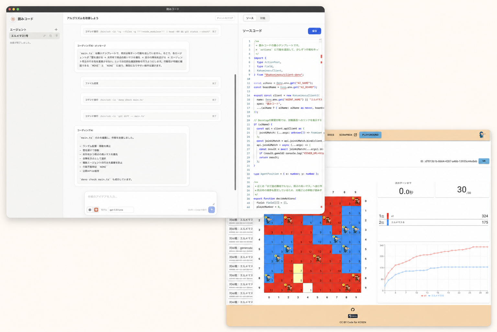

# 囲みコード

<p align="center">
  
</p>

囲みマスで使う AI を、アイデアから育てて対戦へ送り出すためのデスクトップアプリです。
プログラミングにまだ慣れていなくても、同梱のサンプルからすぐに始められます。作戦の改善は、Codex や
Claude Code に日本語で相談できます。

[紹介ページを見る](https://kakomimasu.github.io/kakomi-code/) ·
[囲みマス公式サイト](https://kakomimasu.com/) · [Deno公式サイト](https://deno.com/)

<p align="center">
  
</p>

## できること

- 同梱のサンプルエージェントで、すぐに囲みマスの対戦を試せる
- 作戦ごとにエージェントを分け、複製しながら別のアイデアを安全に試せる
- 「もっと積極的に陣地を取りたい」など、日本語で Codex / Claude Code に改善を頼める
- 公式 AI を相手に、対戦相手と盤面を選んで練習できる
- 画面内のエディターから `main.ts` を直接編集できる

## 必要なもの

- [Deno](https://docs.deno.com/runtime/getting_started/installation/)
- 初回の依存関係取得と対戦に使うインターネット接続

サンプルエージェントの作成と対戦には Deno だけで十分です。チャットから作戦を改善するときだけ、
[Codex CLI](https://learn.chatgpt.com/docs/codex/cli) または
[Claude Code](https://code.claude.com/docs/en/overview) をインストールし、ログインしてください。

## はじめかた

リポジトリを取得します。Gitを使わない場合は、GitHubの「Code」からZIPをダウンロードして展開しても構いません。

```sh
git clone https://github.com/kakomimasu/kakomi-code.git
cd kakomi-code
```

macOS / Linux:

```sh
./run.sh
```

Windows:

```bat
run.bat
```

`run.sh` / `run.bat`
は囲みコードをビルドして、そのまま起動します。初回は必要な依存関係を取得するため、
少し時間がかかることがあります。

VS Code を使う場合は、`Cmd/Ctrl + Shift + B` を押して「囲みコードを起動」を選んでも起動できます。

## 最初の対戦まで

1. 左側の「エージェント」にある `＋` を押し、エージェント名を入力します。
2. 右側の「対戦」タブを開きます。最初はサンプルコードのままで問題ありません。
3. 対戦相手と盤面を選び、「対戦を始める」を押します。対戦相手は `none` または `a1`
   から試すのがおすすめです。
4. 準備ができたら、「対戦画面を開く」から盤面と結果を確認します。

まず一局動かしてから、少しずつ自分の作戦にしていくのがおすすめです。

## 作戦を育てる

チャット欄で Codex または Claude Code
を選び、改善したいことを日本語で入力すると、選択中のエージェントの `main.ts` を更新します。

例:

- 「序盤は自分のタイルを広げることを優先して」
- 「相手の近くでは壁を壊す判断を増やして」
- 「この作戦のねらいを説明してから、改善案を作って」

別の案を試すときは、エージェント一覧の複製ボタンを使います。元の作戦は残るため、気軽に比較できます。
「ソース」タブでコードを直接編集し、「保存」を押すこともできます。

## データの保存場所

- 作ったエージェントは、このリポジトリの `versions/` に保存されます。
- チャット履歴などのアプリ設定は、ホームフォルダ内の `.kakomimasu-ai-starter/` に保存されます。
- 大切な作戦は、`versions/` から別の場所へバックアップしてください。

`versions/` と `.env` はGitへコミットしないでください。

## 困ったときは

- 起動できない場合は、ターミナルで `deno --version` が成功するか確認してください。
- 初回ビルドが進まない場合は、インターネット接続を確認してからもう一度起動してください。
- Codex / Claude Code
  に改善を頼めない場合は、選択したCLIがインストール済みでログイン済みか確認してください。
- 対戦できない場合は、新しいエージェントを作り、サンプルのまま `none`
  を相手に試すと原因を切り分けやすくなります。

## 開発者向け

変更後のフォーマット、lint、型チェック、テストは次のコマンドでまとめて確認できます。

```sh
deno task verify
```

テストだけを実行する場合:

```sh
deno task test
```

素の `deno test` ではファイルや環境変数などの権限が付かないため、このリポジトリでは失敗します。

- [コントリビューションガイド](CONTRIBUTING.md)
- [アーキテクチャ](docs/architecture.md)
- [セキュリティポリシー](SECURITY.md)
- [Codex向けプロジェクト指示](AGENTS.md)

## 参照

- [囲みマス](https://kakomimasu.com/)
- [公式 Deno クライアント](https://github.com/kakomimasu/client-deno)
