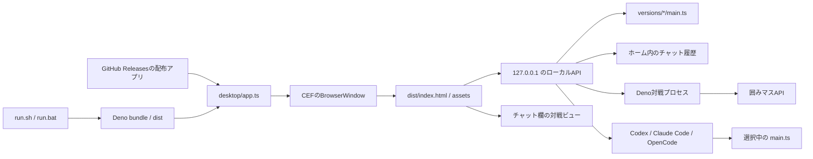

# アーキテクチャ

## 概要

囲みコードは、Deno
Desktopと内蔵Chromium（CEF）で動くローカルデスクトップアプリです。画面はReact、CSS、TypeScriptで構成し、Deno側がローカルAPI、バージョン管理、対戦プロセス、Codex
/ Claude Code / OpenCodeの起動を担当します。

開発、テスト、画面生成、配布ビルドはDenoだけで実行します。React、Monaco
Editor、Zod、Zustandなどのnpmパッケージも
Denoのキャッシュから直接解決するため、Node.js、npmコマンド、`node_modules/` は必要ありません。

## コンポーネント

| 場所                                  | 役割                                                                   |
| ------------------------------------- | ---------------------------------------------------------------------- |
| `run.sh`, `run.bat`                   | `.env` の有無を判定し、OSに合うDeno Desktopタスクを起動する            |
| `scripts/build_release.ts`            | OS・CPUに合う配布形式を検証し、Deno Desktopでビルドする                |
| `.github/workflows/release.yml`       | タグから各OS向け配布ファイルとGitHub Releaseを作る                     |
| `scripts/build_ui.ts`                 | React画面、通常CSS、Monaco Editorを `dist/` へまとめる                 |
| `desktop/index.html`                  | React画面のHTMLとAPIトークンの埋め込み先                               |
| `desktop/app.ts`                      | アプリ起動、APIハンドラー、ローカルHTTP配信の配線                      |
| `desktop/api_requests.ts`             | ローカルAPIへ渡す固定形式の入力スキーマを定義する                      |
| `desktop/application_menu.ts`         | ネイティブメニューと終了ショートカットを構成する                       |
| `desktop/app_paths.ts`                | ソース版・配布版の作業フォルダとテンプレートを解決する                 |
| `desktop/command_resolver.ts`         | Deno、Codex、Claude Code、OpenCodeの実行ファイルをユーザー環境から探す |
| `desktop/coding_agent.ts`             | コーディングAIごとの起動引数を組み立てる                               |
| `desktop/coding_agent_controller.ts`  | 改善依頼、作業フォルダ、検証、停止までの実行フローを管理する           |
| `desktop/coding_agent_environment.ts` | コーディングAIへ渡す環境変数を必要なものだけに限定する                 |
| `desktop/coding_agent_log.ts`         | CLIイベントを共通の画面用ログへ整形する                                |
| `desktop/coding_agent_output.ts`      | CLIのJSON出力を読み取り、AI別イベントをログへ反映する                  |
| `desktop/coding_agent_process.ts`     | コーディングAIと検証用の子プロセスを安全な環境で実行する               |
| `desktop/coding_agent_reference.ts`   | クライアントAPIの参照ソースを取得・キャッシュする                      |
| `desktop/coding_agent_run.ts`         | 改善処理全体の停止状態と実行中プロセスを管理する                       |
| `desktop/match_controller.ts`         | 対戦の準備、実行、停止、一時作業フォルダを管理する                     |
| `desktop/module_graph.ts`             | 対戦AIの静的importを実行前に検証する                                   |
| `desktop/opencode_adapter.ts`         | OpenCodeの権限、作業領域、モデル、イベント形式を扱う                   |
| `desktop/opencode_validator.ts`       | OpenCodeのmodule graph・型検証と再修正を管理する                       |
| `desktop/process_output.ts`           | 子プロセス出力の無害化と保持サイズ上限を共通化する                     |
| `desktop/process_tree.ts`             | コーディングAIと、その子孫プロセスをまとめて停止する                   |
| `desktop/ui.tsx`, `desktop/ui/`       | Reactの起動処理、画面コンポーネント、状態管理用hooks                   |
| `desktop/ui/store/app-store.ts`       | 画面状態を用途別sliceと更新actionへ分けたZustand store                 |
| `desktop/version_manager.ts`          | バージョンの初期化、一覧、作成、検証、名前変更、削除                   |
| `desktop/chat_history.ts`             | チャット履歴の検証と原子的な保存                                       |
| `desktop/http_security.ts`            | ループバック・同一オリジン・APIトークンの検証                          |
| `desktop/input_validation.ts`         | Zodスキーマの検証結果を初心者向けの日本語エラーへ変換する              |
| `desktop/local_server.ts`             | ローカルAPIのルーティングと静的ファイル配信                            |
| `desktop/static_assets.ts`            | `dist/` 内の安全なパスとContent-Typeを検証                             |
| `desktop/terminal_text.ts`            | 端末出力からANSI制御シーケンスを除去                                   |
| `desktop/window_geometry.ts`          | 利用可能な画面領域とウィンドウサイズの検証                             |
| `template/main.ts`                    | 新しいAIの初期コードと囲みマスクライアントの設定                       |
| `website/`                            | GitHub Pagesで公開する、アプリとは独立した静的サイト                   |

## 起動フロー

1. ソース版では、`run.sh` または `run.bat` がDenoの存在を確認します。
2. `.env` がある場合だけ `--env-file=.env` をDenoへ渡します。
3. Denoのバンドラーが `desktop/ui.tsx` からJavaScriptを生成し、HTML、通常CSS、画像、Monaco Editorと
   合わせて `dist/` を作ります。
4. `deno desktop desktop/app.ts` が `dist/` と既存バックエンドを同梱します。 `deno.json` の
   `compile` に追加ファイルを定義し、起動タスクで親アプリの権限を指定します。
   `desktop.backend: "cef"` により各OS向けChromiumもアプリへ同梱します。
5. `desktop/app.ts` が作業フォルダを検出します。配布版では同梱テンプレートを
   `~/.kakomimasu-ai-starter/workspace/` へコピーします。
6. `versions/` がまだ存在しないfresh cloneでは、`template/main.ts` から最初の版を作ります。
7. BrowserWindowと `127.0.0.1` のHTTPサーバーを起動します。
8. 画面の読み込み時に利用可能な表示領域を取得し、メインウィンドウをその大きさへ広げます。

`versions/` が既に存在して空の場合は、利用者が全版を削除した状態として扱い、最初の版を復元しません。

## 画面とローカルAPI

`desktop/ui/api.ts` はDeno Desktopの `bindings` を優先して呼び出し、通常のブラウザでは
`/api/bindings/<name>` へのPOSTへフォールバックします。共有する画面状態はアプリ単位で生成する
Zustandのvanilla storeで管理します。状態は `workspace`、`chat`、`source`、`match`、`shell`
のsliceへ分け、画面はselectorで必要な値だけを購読します。 `desktop/ui/hooks/` のReact hooksはslice
actionを使って用途別の操作と副作用を担当します。Reactで描画する画面と Monaco Editorは
`prefers-color-scheme` を監視し、OSのライト・ダーク設定へ追従します。Deno Desktopの `window.bind`
とHTTP経由の両方で同じハンドラーを公開します。

固定形式のAPI引数、改善依頼、対戦設定、画面サイズはZodスキーマで検証し、検証後の型も同じスキーマから
生成します。利用者にはスキーマ内部のエラーではなく、最初に該当した分かりやすい日本語メッセージを返します。
チャット履歴の総文字数や件数のように、入力全体をまたぐ上限は専用の検証処理で管理します。

`use-kakomi-app.ts`
は画面へ渡す値を組み立て、ダッシュボード、チャット、ソースエディター、対戦、ログ取得、
ペイン幅の各hookへ処理を委譲します。チャットは履歴、改善実行、入力操作へ、ダッシュボードは
ナビゲーションとバージョン操作へさらに分けています。各コンポーネントは状態を直接変更せず、hookが公開する更新関数を
呼び出します。

HTTP経由では次をすべて満たす必要があります。

- URLのホストが `127.0.0.1`、`localhost`、`[::1]` のいずれか
- Originがある場合はリクエストURLと同一オリジン
- `x-kakomi-api-token` が起動時に生成した値と一致
- `Content-Type` が `application/json`
- JSON本文が12 MiB以下

## バージョン管理

管理対象は `versions/` 直下にある次のディレクトリだけです。

- 初期版 `エルメマス1号`
- `vNNN-名前` 形式の版

操作前に実パスを解決し、`versions/` の直接の子であることと `main.ts`
が通常ファイルであることを確認します。これにより、相対パスやシンボリックリンクを使った管理範囲外へのアクセスを防ぎます。

`versions/` は `.gitignore`
の対象です。利用者の作戦はローカルデータであり、リポジトリへコミットしません。

## 対戦プロセス

対戦開始時は選択中の `main.ts`
を別のDenoプロセスで実行します。子プロセスには次の権限だけを渡します。

実行前に `main.ts` と専用の `deno.json`
を、他の利用者ファイルを含まない一時フォルダーへコピーします。`deno info` の完全なmodule
graphを検査し、ローカルimportがその一時フォルダー内にあること、リモートimportが `jsr.io` または
`raw.githubusercontent.com` であることを確認します。`npm:` importは検査、キャッシュ、
実行のすべてで無効化します。その後 `deno cache`
で依存を準備します。これらの処理はAIコードを実行せず、実行本体は `--cached-only`
のため、対戦中に新しい依存を取得しません。

実行本体には次の権限だけを渡します。

- 選択中バージョンから作った一時フォルダーの読み取り
- `KAKOMIMASU_HOST` で指定された通信先への接続
- 対戦に必要な限定された環境変数の読み取り

`--cached-only` と `--no-prompt`
を使い、実行中の依存取得や権限確認待ちを避けます。標準出力と標準エラーは上限付きで保持し、`VIEWER_URL`
を画面へ反映します。ログからANSI制御シーケンスを除去してから画面へ表示します。「対戦画面」タブを押すと、
チャット欄をsandbox付きiframeへ切り替え、検証済みの `https://kakomimasu.com/game`
だけを開始URLとして表示します。

対戦状態は `idle`、`preparing`、`running`、`stopping`
のいずれかで管理します。対戦は画面から途中停止でき、
停止要求後も終了しない場合は3秒後に強制停止します。対戦中は実行対象の版を
名前変更、複製、削除できません。

## コーディングAI

改善依頼ではCodex、Claude Code、OpenCodeのいずれかを子プロセスとして起動します。

- 作業対象は選択中のバージョン
- AIは一時作業フォルダ内で実行し、正常終了時に通常ファイルの `main.ts` だけを選択中の版へ反映
- 長い改善依頼はコマンドライン引数ではなく標準入力で渡す
- 親プロセスの環境を継承せず、CLIの動作と認証に必要な環境変数だけを渡す
- Web検索とブラウザを禁止
- 実装後に `deno check main.ts` を要求
- CLIの構造化イベントを画面用ログへ変換
- ログ件数と文字数に上限を設定

OpenCodeは外部プラグインを読み込まない `--pure` モードで、`main.ts`
だけを置いた一時フォルダ内で起動します。
その中では読み書きだけを許可し、コマンド実行や外部フォルダへのアクセスは拒否します。終了後はファイルサイズを確認し、
アプリ側で静的module graphの境界検証と型チェックを行います。この検証でもnpmを無効化し、import先を
`jsr.io` と `raw.githubusercontent.com`
に限定します。型エラーがあれば結果をOpenCodeへ返して最大2回まで
再修正します。成功した場合だけ選択中の版の `main.ts` へ変更を反映します。

クライアントAPIの参照ソースはアプリ側で取得し、プロンプトへ読み取り専用の資料として渡します。取得できない場合は現在の
`main.ts` だけを根拠に改善します。

停止状態は参照ソースの取得開始前から改善処理の終了まで保持します。参照ソース取得、コーディングAI、OpenCodeの型チェックを
同じ停止操作で中断します。コーディングAIは独立したプロセスグループで起動し、停止時はCLI本体だけでなく、そのCLIが起動した
ツールやhookもまとめて終了します。アプリ終了時は子プロセスの終了と一時作業フォルダの削除を待ってから終了します。

## 保存データ

| データ           | 保存先                                       |
| ---------------- | -------------------------------------------- |
| AIの各バージョン | `<project>/versions/`                        |
| 初回版のコピー元 | `<project>/template/main.ts`                 |
| プロジェクト位置 | `~/.kakomimasu-ai-starter/project-dir.txt`   |
| チャット履歴     | `~/.kakomimasu-ai-starter/chat-history.json` |
| 接続設定         | `<project>/.env`                             |

チャット履歴は読み込み前にファイルサイズを確認し、読み込み後も版数、メッセージ数、総文字数を検証します。保存時は
画面側でも同じ上限へ収め、一時ファイルへ書いた後で置き換えます。

ソース版の `<project>` はリポジトリです。配布版では `~/.kakomimasu-ai-starter/workspace/`
を使うため、アプリのインストール先へ利用者データを書き込みません。

## テスト

- `test/version_manager_test.ts`: ファイル境界、連番、名前変更、削除
- `test/chat_history_test.ts`: 入力検証、保存、破損時の復旧
- `test/agent_workspace_test.ts`: コーディングAIの一時作業フォルダと反映対象
- `test/http_security_test.ts`: ホスト、Origin、APIトークン
- `test/request_body_test.ts`: ローカルAPIのJSON本文サイズ上限
- `test/api_requests_test.ts`: ローカルAPI引数のZodスキーマと日本語エラー
- `test/run_script_test.ts`: `.env` の有無と古いBashでの起動
- `test/main_test.ts`: 初期AIの公開動作
- `test/app_paths_test.ts`: 配布版の作業フォルダと同梱テンプレートの展開
- `test/command_resolver_test.ts`: CLI探索と依存取得先の制限
- `test/coding_agent_test.ts`: OpenCodeの起動引数とファイル・ツール権限
- `test/coding_agent_environment_test.ts`: コーディングAIへ渡す環境変数
- `test/coding_agent_controller_test.ts`, `test/coding_agent_reference_test.ts`:
  改善依頼、プロンプトの制約、参照ソース取得
- `test/coding_agent_output_test.ts`, `test/process_output_test.ts`: CLIイベントと出力上限
- `test/coding_agent_run_test.ts`, `test/process_tree_test.ts`:
  起動前からの停止状態とプロセスツリー停止
- `test/match_controller_test.ts`: 対戦設定と通信先の検証
- `test/local_server_test.ts`: ローカルAPIの統合的な認証とハンドラー呼び出し
- `test/module_graph_test.ts`: 対戦AIのローカル・リモートimport境界

ローカルとCIの共通入口は `deno task verify` です。
