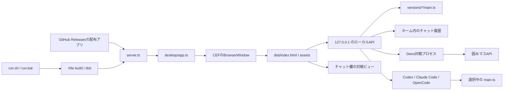

# アーキテクチャ

## 概要

囲みコードは、Deno
Desktopと内蔵Chromium（CEF）で動くローカルデスクトップアプリです。画面はReact、CSS、TypeScriptで構成し、Deno側がローカルAPI、バージョン管理、対戦プロセス、Codex
/ Claude Code / OpenCodeの起動を担当します。

## コンポーネント

| 場所                             | 役割                                                                   |
| -------------------------------- | ---------------------------------------------------------------------- |
| `run.sh`, `run.bat`              | `.env` の有無を判定し、OSに合うDeno Desktopタスクを起動する            |
| `scripts/build_release.ts`       | OS・CPUに合う配布形式を検証し、Deno Desktopでビルドする                |
| `.github/workflows/release.yml`  | タグから各OS向け配布ファイルとGitHub Releaseを作る                     |
| `package.json`, `vite.config.ts` | React画面のVite開発サーバーと `dist/` ビルドを設定する                 |
| `index.html`                     | ViteのHTMLエントリーとAPIトークンの埋め込み先                          |
| `server.ts`                      | Vite自動検出から既存のDeno Desktopバックエンドを起動する               |
| `desktop/app.ts`                 | アプリ起動、APIハンドラー、対戦・コーディングAIの子プロセス管理        |
| `desktop/application_menu.ts`    | ネイティブメニューと終了ショートカットを構成する                       |
| `desktop/app_paths.ts`           | ソース版・配布版の作業フォルダとテンプレートを解決する                 |
| `desktop/command_resolver.ts`    | Deno、Codex、Claude Code、OpenCodeの実行ファイルをユーザー環境から探す |
| `desktop/coding_agent.ts`        | コーディングAIごとの起動引数とOpenCodeの実行時権限を組み立てる         |
| `desktop/ui.tsx`, `desktop/ui/`  | Reactの起動処理、画面コンポーネント、状態管理用hooks                   |
| `desktop/version_manager.ts`     | バージョンの初期化、一覧、作成、検証、名前変更、削除                   |
| `desktop/chat_history.ts`        | チャット履歴の検証と原子的な保存                                       |
| `desktop/http_security.ts`       | ループバック・同一オリジン・APIトークンの検証                          |
| `desktop/static_assets.ts`       | `dist/` 内の安全なパスとContent-Typeを検証                             |
| `desktop/terminal_text.ts`       | 端末出力からANSI制御シーケンスを除去                                   |
| `desktop/window_geometry.ts`     | 利用可能な画面領域とウィンドウサイズの検証                             |
| `template/main.ts`               | 新しいAIの初期コードと囲みマスクライアントの設定                       |
| `website/`                       | GitHub Pagesで公開する、アプリとは独立した静的サイト                   |

## 起動フロー

1. ソース版では、`run.sh` または `run.bat` がDenoの存在を確認します。
2. `.env` がある場合だけ `--env-file=.env` をDenoへ渡します。
3. Viteがルートの `index.html` と `desktop/ui.tsx` から `dist/` を作ります。
4. `deno desktop .` がViteと `server.ts` を自動検出し、`dist/` と既存バックエンドを同梱します。
   `deno.json` の `compile` に追加ファイルを定義し、起動タスクで親アプリの権限を指定します。
   `desktop.backend: "cef"` により各OS向けChromiumもアプリへ同梱します。
5. `desktop/app.ts` が作業フォルダを検出します。配布版では同梱テンプレートを
   `~/.kakomimasu-ai-starter/workspace/` へコピーします。
6. `versions/` がまだ存在しないfresh cloneでは、`template/main.ts` から最初の版を作ります。
7. BrowserWindowと `127.0.0.1` のHTTPサーバーを起動します。
8. 画面の読み込み時に利用可能な表示領域を取得し、メインウィンドウをその大きさへ広げます。

`versions/` が既に存在して空の場合は、利用者が全版を削除した状態として扱い、最初の版を復元しません。

## 画面とローカルAPI

`desktop/ui/api.ts` はDeno Desktopの `bindings` を優先して呼び出し、通常のブラウザでは
`/api/bindings/<name>` へのPOSTへフォールバックします。共有する画面状態はZustandストアで管理し、
`desktop/ui/hooks/` のReact hooksが用途別の操作と副作用を担当します。Reactで描画する画面と Monaco
Editorは `prefers-color-scheme` を監視し、OSのライト・ダーク設定へ追従します。Deno Desktopの
`window.bind` とHTTP経由の両方で同じハンドラーを公開します。

`use-kakomi-app.ts`
は画面へ渡す値を組み立て、ダッシュボード、チャット、ソースエディター、対戦、ログ取得、
ペイン幅の各hookへ処理を委譲します。各コンポーネントは状態を直接変更せず、hookが公開する更新関数を
呼び出します。

HTTP経由では次をすべて満たす必要があります。

- URLのホストが `127.0.0.1`、`localhost`、`[::1]` のいずれか
- Originがある場合はリクエストURLと同一オリジン
- `x-kakomi-api-token` が起動時に生成した値と一致
- `Content-Type` が `application/json`

## バージョン管理

管理対象は `versions/` 直下にある次のディレクトリだけです。

- 初期版 `エルメマス1号`
- `vNNN-名前` 形式の版

操作前に実パスを解決し、`versions/` の直接の子であることと `main.ts`
が通常ファイルであることを確認します。これにより、相対パスやシンボリックリンクを使った管理範囲外へのアクセスを防ぎます。

`versions/` は `.gitignore`
の対象です。利用者の作戦はローカルデータであり、リポジトリへコミットしません。

## 対戦プロセス

対戦開始時は選択中の `main.ts`
を別のDenoプロセスで実行します。子プロセスには次の権限だけを渡します。

実行前に `deno cache` で依存を準備します。この処理はAIコードを実行せず、import先を `jsr.io` と
`raw.githubusercontent.com` に限定します。実行本体は `--cached-only`
のため、対戦中に新しい依存を取得しません。

実行本体には次の権限だけを渡します。

- 選択中バージョンの読み取り
- `KAKOMIMASU_HOST` で指定された通信先への接続
- 対戦に必要な限定された環境変数の読み取り

`--cached-only` と `--no-prompt`
を使い、実行中の依存取得や権限確認待ちを避けます。標準出力と標準エラーは上限付きで保持し、`VIEWER_URL`
を画面へ反映します。ログからANSI制御シーケンスを除去してから画面へ表示します。「対戦画面」タブを押すと、
チャット欄をsandbox付きiframeへ切り替え、検証済みの `https://kakomimasu.com/game`
だけを開始URLとして表示します。

## コーディングAI

改善依頼ではCodex、Claude Code、OpenCodeのいずれかを子プロセスとして起動します。

- 作業対象は選択中のバージョン
- 編集対象は `main.ts` のみ
- Web検索とブラウザを禁止
- 実装後に `deno check main.ts` を要求
- CLIの構造化イベントを画面用ログへ変換
- ログ件数と文字数に上限を設定

OpenCodeは外部プラグインを読み込まない `--pure` モードで、`main.ts`
だけを置いた一時フォルダ内で起動します。
その中では読み書きだけを許可し、コマンド実行や外部フォルダへのアクセスは拒否します。終了後はアプリ側で型チェックし、
型エラーがあれば結果をOpenCodeへ返して最大2回まで再修正します。成功した場合だけ選択中の版の
`main.ts` へ変更を反映します。

クライアントAPIの参照ソースはアプリ側で取得し、プロンプトへ読み取り専用の資料として渡します。取得できない場合は現在の
`main.ts` だけを根拠に改善します。

## 保存データ

| データ           | 保存先                                       |
| ---------------- | -------------------------------------------- |
| AIの各バージョン | `<project>/versions/`                        |
| 初回版のコピー元 | `<project>/template/main.ts`                 |
| プロジェクト位置 | `~/.kakomimasu-ai-starter/project-dir.txt`   |
| チャット履歴     | `~/.kakomimasu-ai-starter/chat-history.json` |
| 接続設定         | `<project>/.env`                             |

チャット履歴は件数、メッセージ数、総文字数を検証し、一時ファイルへ書いた後で置き換えます。

ソース版の `<project>` はリポジトリです。配布版では `~/.kakomimasu-ai-starter/workspace/`
を使うため、アプリのインストール先へ利用者データを書き込みません。

## テスト

- `test/version_manager_test.ts`: ファイル境界、連番、名前変更、削除
- `test/chat_history_test.ts`: 入力検証、保存、破損時の復旧
- `test/http_security_test.ts`: ホスト、Origin、APIトークン
- `test/run_script_test.ts`: `.env` の有無と古いBashでの起動
- `test/main_test.ts`: 初期AIの公開動作
- `test/app_paths_test.ts`: 配布版の作業フォルダと同梱テンプレートの展開
- `test/command_resolver_test.ts`: CLI探索と依存取得先の制限
- `test/coding_agent_test.ts`: OpenCodeの起動引数とファイル・ツール権限

ローカルとCIの共通入口は `deno task verify` です。
