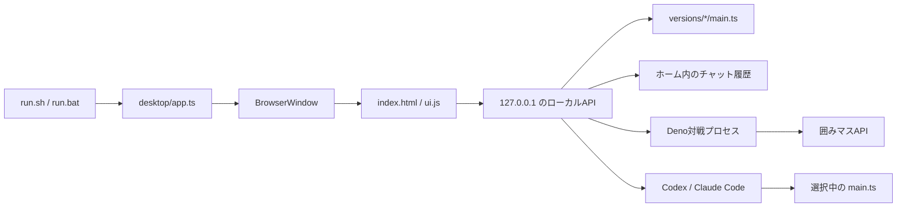

# アーキテクチャ

## 概要

囲みコードは、Deno
Desktopで動くローカルデスクトップアプリです。画面はHTML、CSS、JavaScriptで構成し、Deno側がローカルAPI、バージョン管理、対戦プロセス、Codex
/ Claude Codeの起動を担当します。

## コンポーネント

| 場所                         | 役割                                                            |
| ---------------------------- | --------------------------------------------------------------- |
| `run.sh`, `run.bat`          | `.env` の有無を判定し、OSに合うDeno Desktopタスクを起動する     |
| `desktop/app.ts`             | アプリ起動、APIハンドラー、対戦・コーディングAIの子プロセス管理 |
| `desktop/index.html`         | アプリ画面の構造とAPIトークンの埋め込み先                       |
| `desktop/ui.js`              | Alpine.jsの画面状態、ローカルAPI呼び出し、エディター操作        |
| `desktop/version_manager.ts` | バージョンの初期化、一覧、作成、検証、名前変更、削除            |
| `desktop/chat_history.ts`    | チャット履歴の検証と原子的な保存                                |
| `desktop/http_security.ts`   | ループバック・同一オリジン・APIトークンの検証                   |
| `template/main.ts`           | 新しいAIの初期コードと囲みマスクライアントの設定                |
| `website/`                   | GitHub Pagesで公開する、アプリとは独立した静的サイト            |

## 起動フロー

1. `run.sh` または `run.bat` がDenoの存在を確認します。
2. `.env` がある場合だけ `--env-file=.env` をDenoへ渡します。
3. `deno task desktop:*` がDeno Desktopアプリをビルドします。
4. `desktop/app.ts` がプロジェクトディレクトリを検出します。
5. `versions/` がまだ存在しないfresh cloneでは、`template/main.ts` から最初の版を作ります。
6. BrowserWindowと `127.0.0.1` のHTTPサーバーを起動します。

`versions/` が既に存在して空の場合は、利用者が全版を削除した状態として扱い、最初の版を復元しません。

## 画面とローカルAPI

`desktop/ui.js` は `/api/bindings/<name>` をPOSTで呼び出します。Deno Desktopの `window.bind`
とHTTP経由の両方で同じハンドラーを公開します。

HTTP経由では次をすべて満たす必要があります。

- URLのホストが `127.0.0.1`、`localhost`、`[::1]` のいずれか
- Originがある場合はリクエストURLと同一オリジン
- `x-kakomi-api-token` が起動時に生成した値と一致
- `Content-Type` が `application/json`

## バージョン管理

管理対象は `versions/` 直下にある次のディレクトリだけです。

- 初期版 `エルメマス1号`
- `vNNN-名前` 形式の版

操作前に実パスを解決し、`versions/` の直接の子であることと `main.ts`
が通常ファイルであることを確認します。これにより、相対パスやシンボリックリンクを使った管理範囲外へのアクセスを防ぎます。

`versions/` は `.gitignore`
の対象です。利用者の作戦はローカルデータであり、リポジトリへコミットしません。

## 対戦プロセス

対戦開始時は選択中の `main.ts`
を別のDenoプロセスで実行します。子プロセスには次の権限だけを渡します。

- 選択中バージョンの読み取り
- `KAKOMIMASU_HOST` で指定された通信先への接続
- 対戦に必要な限定された環境変数の読み取り

`--cached-only` と `--no-prompt`
を使い、実行中の依存取得や権限確認待ちを避けます。標準出力と標準エラーは上限付きで保持し、`VIEWER_URL`
を画面へ反映します。

## コーディングAI

改善依頼ではCodexまたはClaude Codeを子プロセスとして起動します。

- 作業対象は選択中のバージョン
- 編集対象は `main.ts` のみ
- Web検索とブラウザを禁止
- 実装後に `deno check main.ts` を要求
- CLIの構造化イベントを画面用ログへ変換
- ログ件数と文字数に上限を設定

クライアントAPIの参照ソースはアプリ側で取得し、プロンプトへ読み取り専用の資料として渡します。取得できない場合は現在の
`main.ts` だけを根拠に改善します。

## 保存データ

| データ           | 保存先                                       |
| ---------------- | -------------------------------------------- |
| AIの各バージョン | `<project>/versions/`                        |
| 初回版のコピー元 | `<project>/template/main.ts`                 |
| プロジェクト位置 | `~/.kakomimasu-ai-starter/project-dir.txt`   |
| チャット履歴     | `~/.kakomimasu-ai-starter/chat-history.json` |
| 接続設定         | `<project>/.env`                             |

チャット履歴は件数、メッセージ数、総文字数を検証し、一時ファイルへ書いた後で置き換えます。

## テスト

- `test/version_manager_test.ts`: ファイル境界、連番、名前変更、削除
- `test/chat_history_test.ts`: 入力検証、保存、破損時の復旧
- `test/http_security_test.ts`: ホスト、Origin、APIトークン
- `test/run_script_test.ts`: `.env` の有無と古いBashでの起動
- `test/main_test.ts`: 初期AIの公開動作

ローカルとCIの共通入口は `deno task verify` です。
